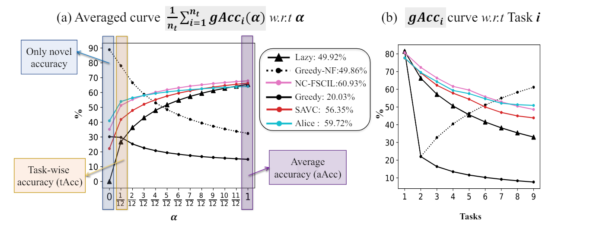
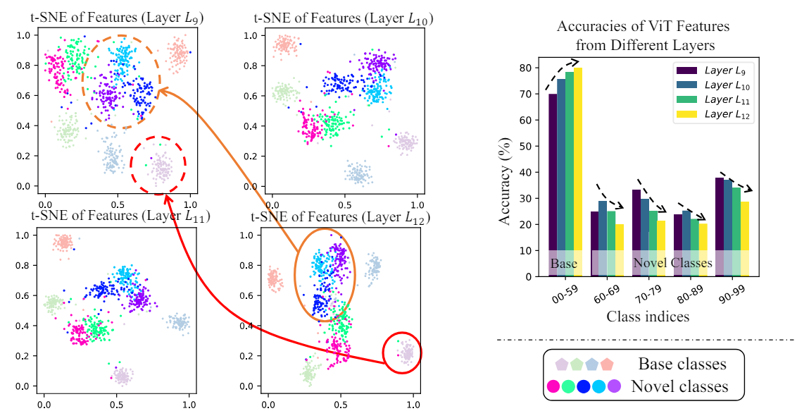
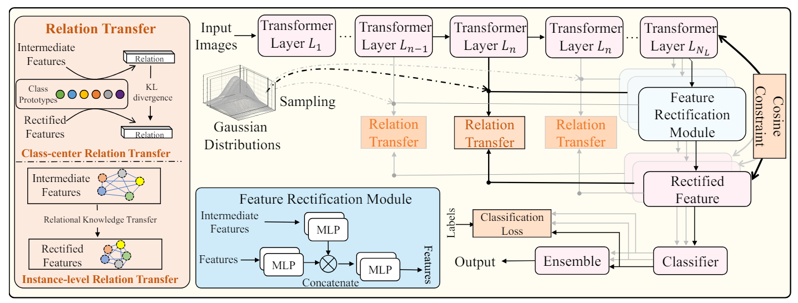

# Rethinking Few-shot Class-incremental Learning: Learning from Yourself (ECCV2024)
### Official PyTorch implementation of our ECCV2024 paper “Rethinking Few-shot Class-incremental Learning: Learning from Yourself”. [[Paper](http://arxiv.org/abs/2407.07468)]


<div align=center> </div>
<div align=center> </div>
<div align=center> </div>

## Introduction 
TL;DR

We proposed a novel metric for a more balanced evaluation of Few-Shot Class-incremental Learning (FSCIL) methods.
Further, we also provide analyses of Vision Transformers(ViT) on FSCIL 
and design the feature rectification module learning from intermediate features.
## Environments

- Python: 3.8.17
- PyTorch: 2.0.1
- timm: 0.5.4

## Data Preparation
We follow prior works to conduct experiments on three standard datasets: CIFAR100, *mini*/ImageNet, and CUB200.
### Download Datasets
- **CIFAR100** dataset will be downloaded automatically to the directory specified by the arg `-dataroot`.

- ***mini*/ImageNet** and *CUB200* datasets cannot be downloaded automatically, we follow the [CEC](https://github.com/icoz69/CEC-CVPR2021),
  and [here](https://drive.google.com/drive/folders/11LxZCQj2FRCs0JTsf_dafvTHqFn2yGSN?usp=sharing) is the download link copied from their repo.

After downloading, please put all datasets into the `./data` directory.

## Training

- **Step1**, download checkpoints trained on the base task (task 1) from these URLs: ([Baidu(password=0000)](https://pan.baidu.com/s/1RBIoiW-KZgfNV_3CNPGkEw
), [Google](https://drive.google.com/file/d/1g_P03Mez0sxAH2NCJE1ZNBZLtwSs-Bxl/view?usp=drive_link) or [OneDrive](https://sunyatsen-my.sharepoint.cn/:u:/g/personal/tangym9_ms_sysu_edu_cn/EcPiIJm23DpBhcENiH3wB_YBhcDJIfRLv_x1YWR_Hqv6Mw?e=nwHfn6))
  and put them into the `checkpoints` path.
Note that if you want to train on task 1, please refer to the **Base task training** section.
- **Step2**, just run ```bash runs/cifar100.sh``` for cifar100 training, ```runs/miniImageNet.sh``` for *mini*/ImageNet training and ```bash runs/cub200.sh``` for CUB200 training.
  ```
   bash runs/cifar100.sh exp_name gpu_id
  ```

## Evaluation
We proposed a novel evaluation metric called *generalized average accuracy* (gAcc), which provides a more balanced assessment of FSCIL methods.
The codes for gAcc is the ```generalised_avg_acc()``` function in `models/metric.py`, which inputs the range of the parameter $\alpha$ and the accuracy at each task.
By default, we show gAcc and aAcc of our method after training of each task, feel free to use this metric for any other methods!

## Base Task Training (optional)
We also provide codes for training our ViT backbone on the base task (task 1, with 60 classes).
To train, please ```cd baseline_inc``` and check the `README.md` in `./baseline_inc`.

## Acknowledgement

- This repository is heavily based
  on [CEC](https://github.com/icoz69/CEC-CVPR2021) and [deit](https://github.com/facebookresearch/deit).

- If you use this paper/code in your research, please consider citing us:

```
@inproceedings{tang2024rethinking,
  title={Rethinking Few-shot Class-incremental Learning: Learning from Yourself},
  author={Tang, Yu-Ming and Peng, Yi-Xing and Meng, Jingke and Zheng, Wei-Shi},
  booktitle={European Conference on Computer Vision},
  year={2024}
}
```
